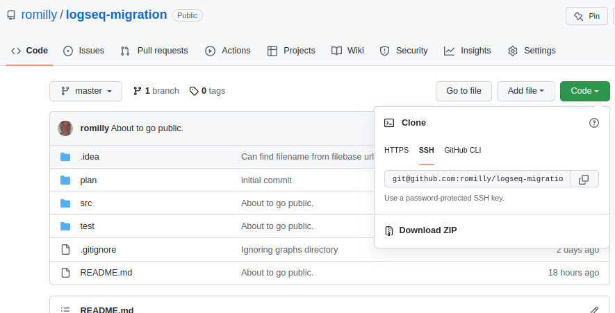

# logseq-migration

**Download and use local copies of assets in logseq after importing a file from roam**.

Roam stores the assets (images, pdfs, mp4 files etc.) in the cloud.

While `logseq` makes it easy for you to import a roam `json` export, your _assets_ will remain in the cloud.

That worries me, because

2. I want to store all the data that I own in my local file system.
3. I want to be able to view my pages even if I am not connected to the Internet.
4. The assets could disappear if roam research ceased trading or changed its policy about closed accounts.

So I adapted the code from [here](https://nicolevanderhoeven.com/blog/20210602-downloading-files-from-roam/) 
to suit `logseq` instead of `Obsidian`, wrote some minimal tests and refactored the code.

## It's currently _beta_ software 

It's had limited testing, but it worked for me on a graph with about 1800 nodes.

Once installed, you can run the code each time you want to process a recently imported
roam graph.

Since the program messes with the markdown in your pages (in order to make asset links local),

**back up your graph before you run this code!**

The application is easy to install and run.
You'll find instructions below.

## Installation

For now, you'll need to 
1. Install required software,
2. Download this code as a zip file,
3. Unzip the file, and
4. Run the migration command by hand whenver you need to process a newly imported graph.

### Install required software

#### Python 3

The code is written in Python, and you  will need an installed copy of Python3.8 or later.

If you don't already have a suitable copy of Python installed, you'll find installation instructions
[here](https://www.python.org/).

#### pip3


`pip` is Python's package manager. You'll need `pip3`, the version that supports Python3.

This is normally installed with Python3. If it isn't for some reason you can follow
[these instructions](https://pip.pypa.io/en/stable/installation/).

#### The `requests` package

`requests` is a 3rd part library which simplifies downloading data from the web. 
it is used by the `logseq-migration` application.

To install it, type `pip3 install requests` in a command/terminal window.

### Download the zip file

(If you're a GitHub user, you can _clone_ the repository instead.
In that case the directory mentioned below will be `logseq-migration`).

In a browser, go to [this page](https://github.com/romilly/logseq-migration).

In the window, click on the green `Code` button.

A dialog box will open.



Click on `Download zip`.

Your browser should download the zip file.

Unzip the file in a directory of your choice.

It will create and fill a sub-directory called `logseq-migrarion-master`

Now, each time you want to localize the assets in a graph that you've just imported from roam,
follow the steps below to run the application

### Run the application

```shell
cd logseq-migration-master/src
python3 migrater.py <vault-directory>
```

where `vault-directory` is the directory in which your `logseq` graph lives.

You should see a list of the firebase urls and the asset file names as they are saved.

The code is [idempotent](https://en.wikipedia.org/wiki/Idempotence).
In other words, if you run it two or more times, nothing _should_ change after the first run.

Let me know how you get on, and please raise an issue if there are problems or you want to
suggest new features.

There's a [roadmap](ROADMAP.md) and a [project journal](plan/journal.md). If you're interested in contributing, get in 
touch.
Help is always welcome!

I'm [@rareblog](https://twitter.com/rareblog) on Twitter.

